# Brand Builder Pro 2.0 - Multi-Agent Architecture

**Total Agents**: 100+ specialized agents across 10 stages
**Architecture Pattern**: Orchestrated Multi-Agent System with Clear Component Separation

---

## 🎯 Core Architecture Principle

Similar to `ui-ux-audit-tool`, each major component is:
- **Self-contained module** with its own agents
- **Clear responsibility** and boundaries
- **Orchestrated** by master controller
- **Independent** but cooperative

---

## 📦 Multi-Agent Component Structure

```
brand-builder-16-oct/
│
├── 🔍 DISCOVERY MODULE (15 Agents)
│   ├── agents/
│   │   ├── contradiction-detector-agent.ts
│   │   ├── gap-analyzer-agent.ts
│   │   ├── market-researcher-agent.ts
│   │   ├── competitor-analyzer-agent.ts
│   │   ├── audience-researcher-agent.ts
│   │   ├── trend-spotter-agent.ts
│   │   ├── pricing-analyst-agent.ts
│   │   ├── channel-analyst-agent.ts
│   │   ├── brand-auditor-agent.ts
│   │   ├── perception-mapper-agent.ts
│   │   ├── whitespace-finder-agent.ts
│   │   ├── inflection-detector-agent.ts
│   │   ├── language-gap-agent.ts
│   │   ├── pattern-recognizer-agent.ts
│   │   └── insight-synthesizer-agent.ts
│   └── orchestrator/
│       └── discovery-orchestrator.ts
│
├── 🎨 STRATEGY MODULE (12 Agents)
│   ├── agents/
│   │   ├── positioning-strategist-agent.ts
│   │   ├── value-proposition-agent.ts
│   │   ├── differentiation-agent.ts
│   │   ├── messaging-architect-agent.ts
│   │   ├── narrative-builder-agent.ts
│   │   ├── voice-tone-agent.ts
│   │   ├── archetype-designer-agent.ts
│   │   ├── persona-creator-agent.ts
│   │   ├── journey-mapper-agent.ts
│   │   ├── touchpoint-optimizer-agent.ts
│   │   ├── experience-designer-agent.ts
│   │   └── strategy-validator-agent.ts
│   └── orchestrator/
│       └── strategy-orchestrator.ts
│
├── 🏗️ GENERATION MODULE (20 Agents)
│   ├── agents/
│   │   ├── visual-identity-agent.ts
│   │   ├── logo-concept-agent.ts
│   │   ├── color-palette-agent.ts
│   │   ├── typography-agent.ts
│   │   ├── iconography-agent.ts
│   │   ├── photography-style-agent.ts
│   │   ├── illustration-guide-agent.ts
│   │   ├── packaging-designer-agent.ts
│   │   ├── naming-strategist-agent.ts
│   │   ├── tagline-creator-agent.ts
│   │   ├── content-strategist-agent.ts
│   │   ├── social-media-agent.ts
│   │   ├── campaign-creator-agent.ts
│   │   ├── asset-producer-agent.ts
│   │   ├── guidelines-writer-agent.ts
│   │   ├── template-creator-agent.ts
│   │   ├── collateral-designer-agent.ts
│   │   ├── presentation-builder-agent.ts
│   │   ├── document-generator-agent.ts
│   │   └── deliverable-packager-agent.ts
│   └── orchestrator/
│       └── generation-orchestrator.ts
│
├── 🛡️ VALIDATION MODULE (15 Agents)
│   ├── agents/
│   │   ├── source-quality-agent.ts         # Layer 1
│   │   ├── fact-checker-agent.ts           # Layer 2
│   │   ├── triple-extractor-agent.ts       # Layer 3
│   │   ├── cross-verifier-agent.ts         # Layer 4
│   │   ├── proof-validator-agent.ts        # Layer 5
│   │   ├── numeric-validator-agent.ts      # Layer 6
│   │   ├── strategy-auditor-agent.ts       # Layer 7
│   │   ├── consistency-checker-agent.ts    # Layer 8
│   │   ├── completeness-verifier-agent.ts
│   │   ├── quality-scorer-agent.ts
│   │   ├── compliance-checker-agent.ts
│   │   ├── plagiarism-detector-agent.ts
│   │   ├── brand-alignment-agent.ts
│   │   ├── production-ready-agent.ts
│   │   └── final-approval-agent.ts
│   └── orchestrator/
│       └── validation-orchestrator.ts
│
├── 📊 ANALYSIS MODULE (10 Agents)
│   ├── agents/
│   │   ├── sentiment-analyzer-agent.ts
│   │   ├── performance-predictor-agent.ts
│   │   ├── roi-calculator-agent.ts
│   │   ├── risk-assessor-agent.ts
│   │   ├── opportunity-scorer-agent.ts
│   │   ├── benchmark-comparator-agent.ts
│   │   ├── market-fit-analyzer-agent.ts
│   │   ├── competitive-advantage-agent.ts
│   │   ├── growth-projector-agent.ts
│   │   └── success-metric-agent.ts
│   └── orchestrator/
│       └── analysis-orchestrator.ts
│
├── 🚀 ACTIVATION MODULE (8 Agents)
│   ├── agents/
│   │   ├── launch-planner-agent.ts
│   │   ├── channel-activator-agent.ts
│   │   ├── campaign-scheduler-agent.ts
│   │   ├── resource-allocator-agent.ts
│   │   ├── timeline-optimizer-agent.ts
│   │   ├── budget-manager-agent.ts
│   │   ├── team-coordinator-agent.ts
│   │   └── milestone-tracker-agent.ts
│   └── orchestrator/
│       └── activation-orchestrator.ts
│
├── 📈 OPTIMIZATION MODULE (6 Agents)
│   ├── agents/
│   │   ├── performance-optimizer-agent.ts
│   │   ├── ab-testing-agent.ts
│   │   ├── feedback-processor-agent.ts
│   │   ├── iteration-planner-agent.ts
│   │   ├── learning-extractor-agent.ts
│   │   └── evolution-recommender-agent.ts
│   └── orchestrator/
│       └── optimization-orchestrator.ts
│
├── 📝 DOCUMENTATION MODULE (5 Agents)
│   ├── agents/
│   │   ├── report-writer-agent.ts
│   │   ├── presentation-creator-agent.ts
│   │   ├── executive-summarizer-agent.ts
│   │   ├── technical-documenter-agent.ts
│   │   └── archive-manager-agent.ts
│   └── orchestrator/
│       └── documentation-orchestrator.ts
│
├── 🔄 INTEGRATION MODULE (4 Agents)
│   ├── agents/
│   │   ├── api-connector-agent.ts
│   │   ├── data-transformer-agent.ts
│   │   ├── webhook-manager-agent.ts
│   │   └── sync-coordinator-agent.ts
│   └── orchestrator/
│       └── integration-orchestrator.ts
│
└── 🎛️ MASTER ORCHESTRATION
    ├── master-orchestrator.ts
    ├── agent-registry.ts
    ├── workflow-engine.ts
    ├── state-manager.ts
    ├── quality-gates.ts
    └── pipeline-controller.ts
```

---

## 🤖 Agent Communication Architecture

```mermaid
graph TB
    MO[Master Orchestrator]

    MO --> DO[Discovery Orchestrator]
    MO --> SO[Strategy Orchestrator]
    MO --> GO[Generation Orchestrator]
    MO --> VO[Validation Orchestrator]
    MO --> AO[Analysis Orchestrator]

    DO --> DA1[Contradiction Detector]
    DO --> DA2[Gap Analyzer]
    DO --> DA3[Market Researcher]
    DO --> DAN[... 12 more agents]

    SO --> SA1[Positioning Strategist]
    SO --> SA2[Value Proposition]
    SO --> SA3[Differentiation]
    SO --> SAN[... 9 more agents]

    GO --> GA1[Visual Identity]
    GO --> GA2[Logo Concepts]
    GO --> GA3[Color Palette]
    GO --> GAN[... 17 more agents]

    VO --> VA1[Source Quality]
    VO --> VA2[Fact Checker]
    VO --> VA3[Triple Extractor]
    VO --> VAN[... 12 more agents]

    AO --> AA1[Sentiment Analyzer]
    AO --> AA2[Performance Predictor]
    AO --> AA3[ROI Calculator]
    AO --> AAN[... 7 more agents]
```



---

## 📋 Clear Component Differentiation

### 1. **DISCOVERY MODULE** (Research & Analysis)
**Purpose**: Understand current state, market, and opportunities
**Agents**: 15 specialized research agents
**Output**: Research insights, gaps, contradictions, opportunities
**Similar to**: ui-ux-audit-tool's analysis agents

### 2. **STRATEGY MODULE** (Planning & Direction)
**Purpose**: Define positioning, messaging, and experience strategy
**Agents**: 12 strategy-focused agents
**Output**: Brand strategy, positioning, messaging architecture
**Unique**: Creative direction and strategic planning

### 3. **GENERATION MODULE** (Content & Asset Creation)
**Purpose**: Create all brand assets and deliverables
**Agents**: 20 creative and production agents
**Output**: 64+ deliverables, visual identity, content
**Unique**: Full creative production pipeline

### 4. **VALIDATION MODULE** (Quality & Verification)
**Purpose**: 8-layer defense system for quality assurance
**Agents**: 15 validation and verification agents
**Output**: Quality scores, verification reports, compliance checks
**Similar to**: ui-ux-audit-tool's validation but more comprehensive

### 5. **ANALYSIS MODULE** (Performance & Metrics)
**Purpose**: Analyze performance and predict success
**Agents**: 10 analytical agents
**Output**: ROI projections, risk assessments, benchmarks
**Unique**: Predictive analytics and scoring

---

## 🔧 Agent Implementation Pattern

Each agent follows this standardized pattern (similar to ui-ux-audit-tool):

```typescript
// Example: contradiction-detector-agent.ts

import { BaseAgent } from '../core/base-agent.js';
import type { AgentInput, AgentOutput } from '../types/agent-types.js';

export class ContradictionDetectorAgent extends BaseAgent {
  name = 'Contradiction Detector';
  version = '1.0.0';
  description = 'Detects contradictions between brand claims and evidence';

  async execute(input: AgentInput): Promise<AgentOutput> {
    // Agent-specific logic
    const contradictions = await this.detectContradictions(input);

    return {
      agentName: this.name,
      status: 'success',
      findings: contradictions,
      confidence: this.calculateConfidence(contradictions),
      recommendations: this.generateRecommendations(contradictions),
    };
  }

  private async detectContradictions(input: AgentInput) {
    // Implementation
  }

  private calculateConfidence(findings: any): number {
    // Confidence scoring logic
  }

  private generateRecommendations(findings: any): string[] {
    // Recommendation generation
  }
}
```

---

## 🎯 Key Differentiators from Other Tools

### vs ui-ux-audit-tool
- **10x more agents** (100+ vs 10+)
- **Broader scope** (entire brand vs just UI/UX)
- **Creative generation** (creates assets, not just audits)
- **Strategy focus** (positioning, messaging, not just analysis)

### vs Single-Purpose Tools
- **End-to-end pipeline** (research → strategy → creation → validation)
- **Multi-domain expertise** (visual, verbal, digital, physical)
- **Orchestrated workflow** (not just parallel execution)
- **Quality gates** between stages

---

## 🔄 Agent Orchestration Flow

```
1. USER INPUT
   ↓
2. MASTER ORCHESTRATOR
   ├─→ Validates input
   ├─→ Creates workflow plan
   └─→ Initiates pipeline
   ↓
3. STAGE ORCHESTRATORS
   ├─→ Discovery Orchestrator → 15 agents
   ├─→ Strategy Orchestrator → 12 agents
   ├─→ Generation Orchestrator → 20 agents
   ├─→ Validation Orchestrator → 15 agents
   └─→ Analysis Orchestrator → 10 agents
   ↓
4. QUALITY GATES
   ├─→ Pass/fail criteria
   ├─→ Retry logic
   └─→ Error handling
   ↓
5. OUTPUT GENERATION
   ├─→ 64+ deliverables
   ├─→ Reports
   └─→ Dashboard
```

---

## 💡 Benefits of Multi-Agent Architecture

1. **Specialization**: Each agent is expert in one thing
2. **Parallelization**: Multiple agents work simultaneously
3. **Modularity**: Easy to add/remove/update agents
4. **Scalability**: Can handle complex brand projects
5. **Quality**: Multiple validation layers
6. **Flexibility**: Configure which agents to use
7. **Transparency**: Clear what each agent does
8. **Maintainability**: Isolated, testable components

---

## 🚀 Implementation Priority

### Phase 1: Core Agents (Week 1)
- Discovery Orchestrator + 5 key agents
- Strategy Orchestrator + 3 key agents
- Validation Orchestrator + 8-layer agents

### Phase 2: Generation Agents (Week 2)
- Generation Orchestrator + 10 creation agents
- Documentation agents
- Asset production agents

### Phase 3: Advanced Agents (Week 3)
- Analysis agents
- Optimization agents
- Integration agents

### Phase 4: Polish (Week 4)
- Agent communication
- Error handling
- Performance optimization

---

## 📊 Success Metrics

- **Agent Performance**: Each agent <30s execution
- **Pipeline Speed**: Full pipeline <10 minutes
- **Quality Score**: Average >8.5/10
- **Parallel Execution**: Up to 10 agents simultaneously
- **Success Rate**: >95% completion rate
- **Modularity**: 100% independent agents

---

This multi-agent architecture ensures **clear differentiation**, **specialized expertise**, and **orchestrated collaboration** - making Brand Builder Pro 2.0 the most comprehensive brand intelligence platform available.