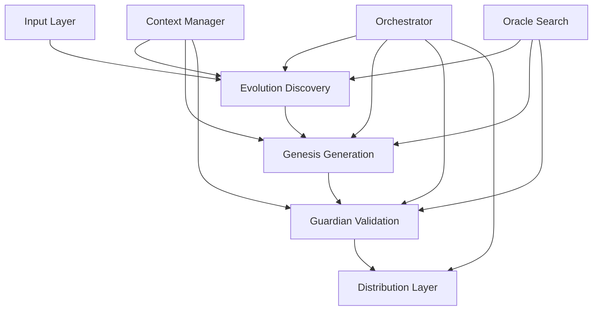

# Brand Builder Pro 2.0 - Unified Architecture

**Version**: 2.0.0
**Status**: Implementation in Progress
**Last Updated**: 2025-10-17

---

## Executive Summary

Brand Builder Pro 2.0 unifies the capabilities of 4 distinct projects into a comprehensive brand intelligence platform:

1. **Evolution Workshop** (brand-builder-16-oct) - 5-phase contradiction detection & strategy evolution
2. **Horizon Brand Builder** - 77 research topics, 64 deliverables, project tracking
3. **Brand Quality Auditor** - 8-layer defense system for quality verification
4. **Agentic Brand Builder** - 6-stage orchestration framework with 40 agents

---

## 🏗️ System Architecture

### 10-Stage Intelligent Pipeline

```
┌────────────────────────────────────────────────────────────────┐
│                    BRAND BUILDER PRO 2.0                        │
│                  Unified Brand Intelligence Platform            │
├────────────────────────────────────────────────────────────────┤
│                                                                  │
│  ┌──────────────────────────────────────────────────────────┐  │
│  │                     INPUT LAYER                           │  │
│  ├──────────────────────────────────────────────────────────┤  │
│  │  • Web Crawler (URLs, competitor analysis)               │  │
│  │  • Document Ingestion (PDF/DOCX/XLSX/Markdown)          │  │
│  │  • API Inputs (JSON/YAML configurations)                │  │
│  └──────────────────────────────────────────────────────────┘  │
│                              ↓                                  │
│  ┌──────────────────────────────────────────────────────────┐  │
│  │           STAGE 1-3: DISCOVERY PIPELINE                   │  │
│  │               (Evolution Workshop)                        │  │
│  ├──────────────────────────────────────────────────────────┤  │
│  │  1. Research Blitz                                       │  │
│  │     └─ Contradiction detection (7+ types)               │  │
│  │     └─ Market gap analysis                              │  │
│  │     └─ Competitor assessment                            │  │
│  │                                                          │  │
│  │  2. Pattern Analysis                                     │  │
│  │     └─ Language gaps identification                     │  │
│  │     └─ Inflection point detection                       │  │
│  │     └─ White space opportunities                        │  │
│  │                                                          │  │
│  │  3. Creative Direction                                   │  │
│  │     └─ Interactive workshop                             │  │
│  │     └─ Strategic choices capture                        │  │
│  │     └─ Direction validation                             │  │
│  └──────────────────────────────────────────────────────────┘  │
│                              ↓                                  │
│  ┌──────────────────────────────────────────────────────────┐  │
│  │          STAGE 4-6: GENERATION PIPELINE                   │  │
│  │              (Horizon Framework)                          │  │
│  ├──────────────────────────────────────────────────────────┤  │
│  │  4. Strategy Generation                                  │  │
│  │     └─ 77 Research Topics                               │  │
│  │     └─ 64 Deliverables Framework                        │  │
│  │     └─ Project Tracking System                          │  │
│  │                                                          │  │
│  │  5. Content Creation                                     │  │
│  │     └─ Brand narrative                                  │  │
│  │     └─ Messaging architecture                           │  │
│  │     └─ Voice & tone guidelines                          │  │
│  │                                                          │  │
│  │  6. Asset Production                                     │  │
│  │     └─ Visual identity system                           │  │
│  │     └─ Brand guidelines                                 │  │
│  │     └─ Marketing collateral                             │  │
│  └──────────────────────────────────────────────────────────┘  │
│                              ↓                                  │
│  ┌──────────────────────────────────────────────────────────┐  │
│  │          STAGE 7-8: VALIDATION PIPELINE                   │  │
│  │            (8-Layer Defense System)                       │  │
│  ├──────────────────────────────────────────────────────────┤  │
│  │  7. Quality Verification                                 │  │
│  │     Layer 1: Source Quality Assessment                   │  │
│  │     Layer 2: Fact Checking                              │  │
│  │     Layer 3: Triple Extraction                          │  │
│  │     Layer 4: Cross-Source Verification                  │  │
│  │     Layer 5: Proof Point Validation                     │  │
│  │     Layer 6: Numeric Variance Validation                │  │
│  │     Layer 7: Strategy Audit                             │  │
│  │     Layer 8: Enhanced Assessment                        │  │
│  │                                                          │  │
│  │  8. Production Readiness                                 │  │
│  │     └─ Completeness check                               │  │
│  │     └─ Quality scoring (0-10)                           │  │
│  │     └─ Missing components identification                │  │
│  └──────────────────────────────────────────────────────────┘  │
│                              ↓                                  │
│  ┌──────────────────────────────────────────────────────────┐  │
│  │           STAGE 9-10: DELIVERY PIPELINE                   │  │
│  │          (Agentic Framework + New)                        │  │
│  ├──────────────────────────────────────────────────────────┤  │
│  │  9. Document Generation                                  │  │
│  │     └─ 46+ document templates                           │  │
│  │     └─ Dynamic content injection                        │  │
│  │     └─ Multi-format support                             │  │
│  │                                                          │  │
│  │  10. Distribution                                        │  │
│  │     └─ HTML Dashboard                                   │  │
│  │     └─ PDF Reports                                      │  │
│  │     └─ API Endpoints                                    │  │
│  │     └─ Export Formats (JSON/CSV/XLSX)                   │  │
│  └──────────────────────────────────────────────────────────┘  │
│                                                                  │
│  ┌──────────────────────────────────────────────────────────┐  │
│  │               ORCHESTRATION LAYER                         │  │
│  │              (Agentic Master Orchestrator)               │  │
│  ├──────────────────────────────────────────────────────────┤  │
│  │  • Master Orchestrator (parallel execution)             │  │
│  │  • Stage Orchestrator (sequential management)           │  │
│  │  • Quality Gates (pass/fail criteria)                   │  │
│  │  • State Management (persistence)                       │  │
│  │  • Error Handling (retry logic)                         │  │
│  └──────────────────────────────────────────────────────────┘  │
│                                                                  │
└────────────────────────────────────────────────────────────────┘
```

---

## 📦 Module Structure

### Core Modules from Legacy Projects

```
brand-builder-16-oct/
├── src/
│   ├── evolution/          # FROM: Current brand-builder-16-oct
│   │   ├── evolution-orchestrator.ts (382 lines) ✅
│   │   ├── research-blitz.ts ✅
│   │   ├── pattern-presenter.ts ✅
│   │   ├── creative-director.ts ✅
│   │   ├── validation-engine.ts ✅
│   │   └── build-out-generator.ts (645 lines) ✅
│   │
│   ├── genesis/           # FROM: Horizon Brand Builder
│   │   ├── project-tracker.ts (404 lines)
│   │   ├── research-database.ts (402 lines)
│   │   ├── report-generator.ts (247 lines)
│   │   ├── llm-service.ts
│   │   ├── web-research-service.ts (518 lines)
│   │   ├── source-quality-assessor.ts (478 lines)
│   │   ├── fact-checker-enhanced.ts (436 lines)
│   │   ├── config/
│   │   │   ├── research-topics.ts (77 topics)
│   │   │   └── deliverables-framework.ts (64 deliverables)
│   │   └── agents/
│   │       ├── orchestrator-agent.ts
│   │       ├── researcher-v2.ts (400 lines)
│   │       └── brand-discovery-agent.ts (431 lines)
│   │
│   ├── guardian/          # FROM: Brand Quality Auditor
│   │   ├── auditors/
│   │   │   ├── source-quality-assessor.ts (478 lines)
│   │   │   ├── enhanced-source-quality-assessor.ts (612 lines)
│   │   │   ├── fact-checker-enhanced.ts (436 lines)
│   │   │   ├── fact-triple-extractor.ts (354 lines)
│   │   │   ├── cross-source-verifier.ts (388 lines)
│   │   │   ├── proof-point-validator.ts (335 lines)
│   │   │   ├── numeric-variance-validator.ts (363 lines)
│   │   │   ├── brand-strategy-auditor.ts (403 lines)
│   │   │   └── enhanced-brand-strategy-auditor.ts (578 lines)
│   │   └── report-generator.ts (164 lines)
│   │
│   ├── orchestrator/      # FROM: Agentic Brand Builder
│   │   ├── master-orchestrator.ts (343 lines)
│   │   ├── stage-orchestrator.ts
│   │   ├── agent-factory.ts (130 lines)
│   │   └── quality-gates.ts
│   │
│   ├── agents/            # FROM: Agentic (20 implemented)
│   │   ├── base-agent.ts (210 lines)
│   │   ├── stage1/ (6 agents)
│   │   ├── stage2/ (6 agents)
│   │   ├── stage3/ (4 agents)
│   │   ├── stage4/ (2 agents)
│   │   ├── stage5/ (1 agent)
│   │   └── stage6/ (1 agent)
│   │
│   ├── oracle/            # NEW: Semantic Search
│   │   ├── python-bridge.ts
│   │   ├── chroma-client.ts
│   │   ├── vector-store.ts
│   │   └── retrieval-engine.ts
│   │
│   ├── context/           # NEW: Context Management
│   │   ├── workspace-manager.ts
│   │   ├── state-persistence.ts
│   │   ├── file-watcher.ts
│   │   └── knowledge-graph.ts
│   │
│   ├── ingestion/         # NEW: Document Processing
│   │   ├── pdf-parser.ts
│   │   ├── docx-parser.ts
│   │   ├── xlsx-parser.ts
│   │   ├── markdown-parser.ts
│   │   └── metadata-extractor.ts
│   │
│   ├── distribution/      # NEW: Output Generation
│   │   ├── html-dashboard.ts
│   │   ├── pdf-generator.ts
│   │   ├── api-server.ts
│   │   └── export-manager.ts
│   │
│   ├── types/             # Unified Type System
│   │   ├── index.ts (exports all)
│   │   ├── evolution-types.ts ✅
│   │   ├── genesis-types.ts
│   │   ├── guardian-types.ts
│   │   ├── orchestrator-types.ts
│   │   └── unified-types.ts
│   │
│   ├── utils/             # Shared Utilities
│   │   ├── logger.ts ✅
│   │   ├── web-fetcher.ts ✅
│   │   ├── json-parser.ts ✅
│   │   ├── cli-output.ts ✅
│   │   └── file-system.ts ✅
│   │
│   └── cli/               # Unified CLI
│       ├── index.ts ✅
│       └── commands/
│           ├── init.ts ✅
│           ├── evolve.ts ✅
│           ├── generate.ts
│           ├── audit.ts
│           ├── search.ts
│           └── orchestrate.ts
```

---

## 🔄 Integration Points

### 1. Data Flow Between Modules



### 2. Shared Services

**Context Manager** (Multi-brand workspace)
- Manages brand-specific workspaces
- Persists state across sessions
- Tracks file changes
- Maintains knowledge graph

**Oracle Engine** (Semantic search)
- ChromaDB vector store
- Python-TypeScript bridge
- Retrieval-augmented generation
- Cross-document search

**Ingestion Pipeline** (Document processing)
- PDF extraction with OCR
- DOCX parsing with formatting
- XLSX data extraction
- Markdown processing

---

## 📊 Component Integration Matrix

| Component | From Project | Lines of Code | Integration Priority | Status |
|-----------|--------------|---------------|---------------------|--------|
| Evolution Workshop | brand-builder-16-oct | 2,000+ | HIGH | ✅ Complete |
| 77 Research Topics | Horizon | 500+ | HIGH | 🔄 Pending |
| 64 Deliverables | Horizon | 400+ | HIGH | 🔄 Pending |
| Project Tracker | Horizon | 404 | MEDIUM | 🔄 Pending |
| Research Database | Horizon | 402 | MEDIUM | 🔄 Pending |
| 8-Layer Defense | Auditor | 3,469 | HIGH | 🔄 Pending |
| Master Orchestrator | Agentic | 343 | HIGH | 🔄 Pending |
| 20 Agents | Agentic | 4,000+ | MEDIUM | 🔄 Pending |
| Oracle Engine | New | TBD | LOW | ⏳ Future |
| Context Manager | New | TBD | MEDIUM | ⏳ Future |

---

## 🎯 Key Design Principles

### 1. Modular Architecture
- Each module is self-contained
- Clear interfaces between modules
- Dependency injection pattern
- Testable in isolation

### 2. Type Safety
- TypeScript strict mode
- Zod validation schemas
- No `any` types
- Comprehensive interfaces

### 3. Quality First
- 8-layer validation system
- Quality gates between stages
- Automated testing
- Production readiness checks

### 4. Scalability
- Parallel execution where possible
- Caching layer for expensive operations
- Streaming for large documents
- Multi-brand support

### 5. Extensibility
- Plugin architecture for new agents
- Template system for deliverables
- Configurable pipelines
- Custom validation rules

---

## 🔧 Technical Stack

### Core Technologies
- **Language**: TypeScript 5.0+ (strict mode)
- **Runtime**: Node.js 20+
- **Module System**: ES Modules
- **Testing**: Vitest
- **Validation**: Zod

### AI/ML
- **Claude AI**: Anthropic SDK
- **Vector Store**: ChromaDB
- **Embeddings**: OpenAI Ada-002
- **Python Bridge**: Child process + IPC

### Data Storage
- **Database**: SQLite (state persistence)
- **Cache**: In-memory + Redis (optional)
- **File System**: Structured workspace
- **Vector DB**: ChromaDB

### Dependencies
```json
{
  "@anthropic-ai/sdk": "^0.67.0",
  "axios": "^1.12.2",
  "better-sqlite3": "^9.6.0",
  "chalk": "^5.3.0",
  "cheerio": "^1.1.2",
  "chokidar": "^3.6.0",
  "commander": "^12.1.0",
  "inquirer": "^12.10.0",
  "marked": "^16.4.1",
  "ora": "^8.1.0",
  "p-retry": "^7.1.0",
  "pdf-parse": "^1.1.1",
  "puppeteer": "^23.5.3",
  "zod": "^3.23.8"
}
```

---

## 🚀 Implementation Phases

### Phase 1: Foundation (Week 1-2)
- [x] Unified architecture documentation
- [ ] Port Evolution Workshop
- [ ] Integrate research topics
- [ ] Port deliverables framework
- [ ] Create unified type system

### Phase 2: Core Pipeline (Week 3-4)
- [ ] Port 8-layer defense system
- [ ] Integrate orchestration framework
- [ ] Port key agents (20)
- [ ] Create quality gates

### Phase 3: Advanced Features (Week 5-6)
- [ ] Build Oracle engine
- [ ] Implement Context Manager
- [ ] Create Ingestion pipeline
- [ ] Add caching layer

### Phase 4: Output & Distribution (Week 7)
- [ ] Document generation system
- [ ] HTML dashboard
- [ ] API endpoints
- [ ] Export formats

### Phase 5: Testing & Polish (Week 8)
- [ ] Unit tests (80% coverage)
- [ ] Integration tests
- [ ] E2E tests
- [ ] Documentation

---

## 📈 Success Metrics

### Quality Metrics
- **Quality Score**: >8.5/10 average
- **Test Coverage**: >80%
- **TypeScript Errors**: 0
- **Critical Bugs**: 0

### Performance Metrics
- **Full Pipeline**: <10 minutes
- **Research Phase**: <3 minutes
- **Validation Phase**: <2 minutes
- **Document Generation**: <1 minute

### Business Metrics
- **Deliverables Generated**: 46+
- **Accuracy Rate**: >95%
- **Multi-Brand Support**: 10+ concurrent
- **API Response Time**: <500ms

---

## 🔐 Security Considerations

### API Security
- Environment variable management
- API key rotation support
- Rate limiting implementation
- Request validation

### Data Security
- Input sanitization
- SQL injection prevention
- XSS protection
- File access restrictions

### Privacy
- PII detection and masking
- GDPR compliance ready
- Data retention policies
- Audit logging

---

## 🎨 Future Enhancements

### Version 2.1 (Q2 2025)
- Implement remaining 20 agents
- Add A/B testing framework
- Multi-language support
- Advanced analytics dashboard

### Version 3.0 (Q3 2025)
- Microservices architecture
- Kubernetes deployment
- Real-time collaboration
- AI model fine-tuning

---

## 📝 Notes

- All file sizes must remain <500 lines (split if larger)
- TypeScript strict mode is mandatory
- Use ES module syntax with .js extensions
- Regular commits to GitHub required
- Run type-check before each commit

---

**Status**: Active Development
**Next Update**: After Phase 1 completion
**Repository**: https://github.com/kalpeshjaju/brand-builder-16-oct